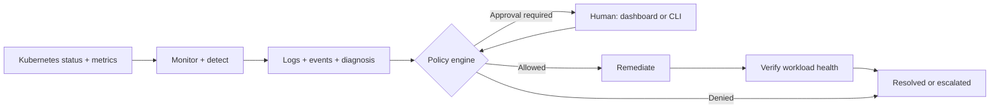

# InfraHealer

**A Kubernetes remediation prototype that separates AI diagnosis from permission to act.**

InfraHealer detects pod failures and early warning signals, gathers incident evidence, and asks a model to recommend an action. A deterministic policy engine decides whether to execute, request human approval, or escalate. Every incident has a persisted timeline, and an action is only marked successful after workload health checks pass.

Built with Python, Kubernetes, Pydantic, SQLite, and Flask. Runs locally against a kind cluster; the default diagnosis provider needs no API key.

**Public demo deployment:** [Deploy the interactive simulation on Render](docs/render.md). Visitors can trigger scripted incidents, approve or reject actions, and follow recovery without a Kubernetes cluster or API key.

## See the flow



## What it demonstrates

- **Reactive detection:** CrashLoopBackOff, OOMKilled, and restart thresholds, with deduplication across polling cycles.
- **Predictive detection:** memory growth fitted with linear regression and restart activity before the reactive threshold. Memory predictions require distinct samples, sufficient duration, and fit quality; confidence is a heuristic, not a calibrated probability.
- **Structured diagnosis:** fake, Ollama, and Anthropic providers share a strict JSON contract. Invalid output is retried once; unusable diagnoses escalate.
- **Controlled execution:** action allowlists, confidence thresholds, human approvals, duplicate execution claims, and an autonomy rate check.
- **Verification and visibility:** consecutive healthy checks, SQLite incident history, and a live dashboard with approval controls.

The demo workload deliberately persists a crash marker across container restarts using an `emptyDir` volume. Replacing the pod removes that marker, giving the restart action a concrete, explainable recovery scenario.

## Quick start

Use Python 3.12. For the cluster demo, install Docker, kind, and kubectl and start Docker.

```bash
python3 -m venv .venv
source .venv/bin/activate
python -m pip install -r requirements.txt
make test PYTHON=python
```

Tests use local fakes and require no cluster or model credentials. To try diagnosis alone:

```bash
python -m agent.diagnose.cli diagnose tests/fixtures/incidents/crashloop.json --provider fake
```

For the full demo:

```bash
make demo-up
make agent-run                 # terminal 1: human approval, fake provider
make dashboard                 # terminal 2: http://127.0.0.1:8000
make crash                     # terminal 3: inject a persistent crash
```

Wait for an incident, approve `RESTART_POD` in the dashboard, then follow its timeline through remediation and verification. See the [demo guide](docs/demo.md) for the full walkthrough, predictive scenario, and troubleshooting.

## Modes and actions

| Mode | Behavior |
| --- | --- |
| `OBSERVE_ONLY` | Records the recommendation and escalates without executing. |
| `HUMAN_APPROVAL` (default) | Requires approval for each allowed action. |
| `AUTONOMOUS` | Executes allowed actions at confidence ≥ 0.8, subject to the rate check; otherwise requests approval. |

Only `RESTART_POD` is allowed by default. `SCALE_UP` and `ROLLBACK` are implemented but require explicit allowlisting. Predictions require human approval even in autonomous mode unless explicitly enabled. Human approval does not bypass the allowlist, observe-only mode, or duplicate-action guard.

```bash
make agent-run MODE=AUTONOMOUS PROVIDER=fake
python -m agent.main --db infra-healer.db list
python -m agent.main --db infra-healer.db approve <incident-id>
python -m agent.main run --help
```

For local model diagnosis, run Ollama with `qwen2.5:7b` available and use `PROVIDER=ollama`. For Anthropic, set `ANTHROPIC_API_KEY` and use `PROVIDER=anthropic`; set `INFRAHEALER_MODEL` to select a model available to your account. The offline fake provider is a fixed mapping from finding kind and makes no inference from logs.

## Repository map

| Path | Responsibility |
| --- | --- |
| [`agent/monitor`](agent/monitor) | Pod snapshots, Metrics API ingestion, rolling history, polling |
| [`agent/detect`](agent/detect) | Pure reactive and predictive rules |
| [`agent/diagnose`](agent/diagnose) | Evidence collection, provider adapters, strict validation |
| [`agent/policy/engine.py`](agent/policy/engine.py) | Ordered, deterministic authorization rules |
| [`agent/healer.py`](agent/healer.py) | Incident orchestration and error handling |
| [`agent/state`](agent/state) | Lifecycle transitions, persistence, execution claims |
| [`agent/remediate`](agent/remediate) / [`agent/verify`](agent/verify) | Kubernetes actions and health verification |
| [`dashboard`](dashboard) | Flask API, SSE updates, approval UI |
| [`demo-service`](demo-service) / [`k8s`](k8s) | Fault injection workload and deployment |
| [`tests`](tests) | Rule, policy, persistence, provider, dashboard, and orchestration tests |

## Scope and engineering tradeoffs

This is a local demonstration prototype. It does not provide production RBAC manifests, authenticated multi-user access, leader election, or automatic recovery of interrupted incidents. The rate check is not an atomic global execution budget under concurrent workers. Verification checks pod readiness and critical failure signals, not payment correctness or long-term application recovery.

The [architecture notes](docs/architecture.md) explain these boundaries and the next engineering steps. The [interview walkthrough](docs/demo.md#interview-talking-points) connects the implementation to design decisions without claiming production guarantees.
