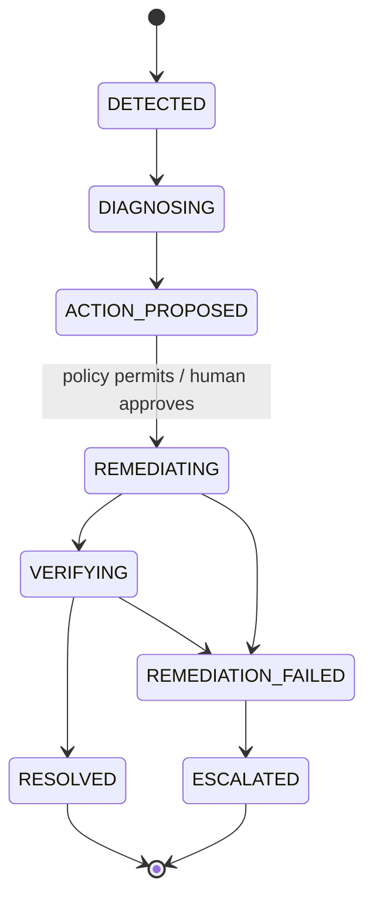

# Architecture and design decisions

## Runtime

`agent.main` builds Kubernetes clients, a shared SQLite store, a diagnosis provider, and the healing components. A polling watcher emits new findings into a four-worker thread pool. A separate thread checks human decisions every two seconds. The dashboard runs in another process against the same database.

1. The watcher flattens pod state into immutable `PodSnapshot` observations, adds optional metrics, and retains up to 200 observations per pod UID.
2. Pure detection functions evaluate current state and history. Finding keys suppress repeated reports; conditions must disappear for 30 seconds before they can fire again.
3. The store creates one open incident per pod UID. An observed failure can supersede a prediction still awaiting approval.
4. Context collection includes bounded logs, recent events, and history. Missing logs/events degrade to empty evidence.
5. The diagnoser validates the provider's raw response with Pydantic. Schema failures get one corrective retry; transport failures return immediately.
6. Policy selects `DENY`, `REQUIRE_APPROVAL`, or `EXECUTE`. Approved proposals are checked against policy again before execution.
7. The remediator claims the incident/action pair before calling Kubernetes. The verifier waits for stabilization and then requires consecutive healthy checks.

## Incident lifecycle

Every nonterminal state also permits escalation. The store rejects illegal transitions and records transitions in an append-only event timeline. Pending approval is a field on `ACTION_PROPOSED`, rather than another lifecycle state.

## Why separate diagnosis from authorization?

A model is useful for interpreting incomplete logs and events, but its recommendation is untrusted input. The model supplies a bounded action enum and confidence; it never supplies a shell command. The policy engine independently checks the action and confidence, then applies ordered rules. The executor checks its own allowlist as well.

JSON encoding and prompt instructions identify cluster evidence as untrusted data. These measures do not eliminate prompt injection. The enforceable boundary is the restricted action contract plus deterministic policy and executor checks.

## Predictive rules

Memory prediction fits a least-squares line over distinct Metrics API timestamps since the last restart. Defaults require at least five samples across 40 seconds, R² ≥ 0.85, growth ≥ 1 KiB/s, and an estimated time to the limit of at most five minutes. Confidence combines fit quality and sample count and is capped at 0.95.

Restart prediction counts restart increments in a ten-minute observation window before the reactive threshold of three restarts. It detects recent activity; it does not estimate a statistical acceleration model.

Metrics-server is optional. When it is unavailable, memory predictions stop while status-based detection continues. Memory is aggregated across containers, which can miss a single container approaching its own limit. The history is in memory and resets on agent restart.

## Persistence and delivery guarantees

SQLite uses WAL and a busy timeout for file-backed stores shared by agent and dashboard. A partial unique index prevents multiple open incidents per pod. A primary key on `(incident_id, action)` prevents duplicate claims.

Claim-before-act provides **at-most-once attempts per incident/action**, not exactly-once external effects. If the process crashes after claiming, it cannot know whether Kubernetes accepted the operation. Startup reconciliation is not implemented, so interrupted incidents can remain open. Incident updates and their timeline inserts are separate autocommit statements; they are not a single crash-atomic transaction.

The dashboard first fetches incident views and a sequence cursor, then subscribes to SSE updates. Each update sends a full incident view. Its batch cursor is shared across frames, leaving a reconnect gap if a connection drops midway through a batch; a fresh page load reloads incident views.

## Tests

The suite exercises detection thresholds, metric timestamp deduplication, restart segmentation, invalid model output, approval behavior, execution claims, lifecycle transitions, verification failures, and dashboard guards. The policy invariant sweep checks 46,080 combinations of modes, actions, confidence, allowlists, prior attempts, rate counts, approvals, and predictive settings.

Kubernetes and provider interactions use fakes. Passing tests establish local behavior; they do not establish compatibility with a live cluster or a provider account.

## Boundaries and next steps

| Current boundary | Next engineering step |
| --- | --- |
| Concurrent workers check rate counts before claiming | Atomically reserve an autonomy budget with the execution claim |
| No restart reconciliation | Reconcile open incidents and claimed executions at startup |
| Pod UID checked before deletion, without a delete precondition | Use Kubernetes UID preconditions to close the read/delete race |
| Scale and rollback resolve ownership by pod name | Validate target identity and resource versions before mutation |
| Label-based verification can select too broadly if labels are empty | Persist validated controller identity and its selector |
| Readiness checks do not prove application recovery | Add service-level checks and longer observation windows |
| Local dashboard has no authentication | Add identity, authorization, and approval audit attribution before remote use |
| Dependency ranges and mocked provider tests | Lock a tested environment and add opt-in integration checks |

The demo intentionally keeps these tradeoffs visible so its guarantees can be discussed and evaluated precisely.
