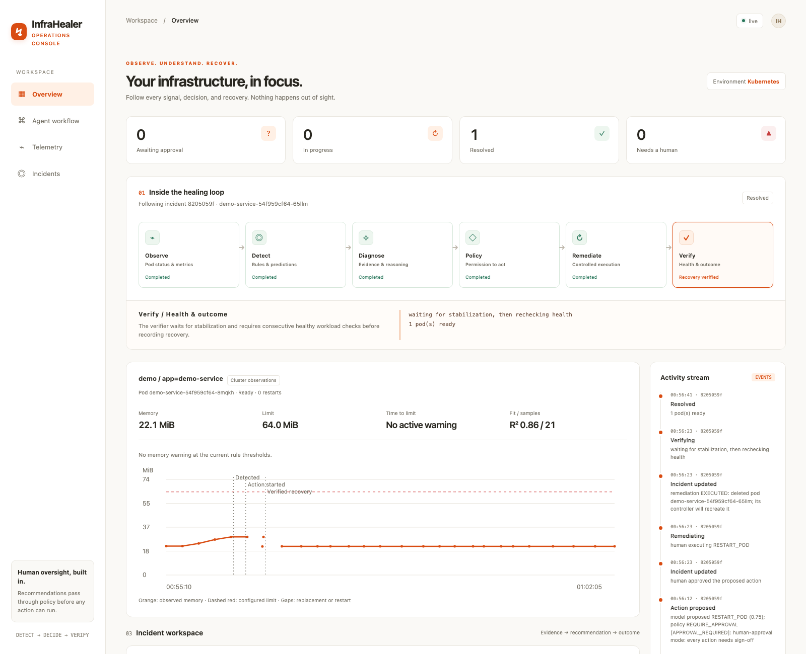

# Real Kubernetes memory-leak demonstration

This walkthrough uses actual kind pod metrics, fault injection, pod replacement, and readiness verification. Diagnosis can use the offline fake provider, Ollama, or Anthropic. State explicitly which provider you use: fake diagnosis is scripted even when the cluster execution is real.

## Validated run

The checked-in [incident export](evidence/memory-recovery.json) records an actual local run with the fake diagnosis provider. The rule detected memory rising at 131 KiB/s with R² 0.93 across five samples: approximately 29/64 MiB used and 271 seconds to the limit. After approval, the agent deleted the original pod, verified its replacement was ready, and recorded `RESOLVED`. Replacement memory measured about 22 MiB. The time estimate assumes the measured growth continues; injection stopped when the incident opened.



## Run

Activate the virtual environment in each terminal. Complete `make demo-up` and `make metrics` first if the local cluster is not already set up. Ensure `kubectl --context kind-infra-healer -n demo top pods` returns metrics.

```bash
# Terminal 1: explicit local context, demo workload only, human approval
make real-agent DB=real-demo.db PROVIDER=fake

# Terminal 2: real dashboard, separate from the public simulation
python -m dashboard.app --db real-demo.db --port 8001

# Terminal 3: bounded leak, stops when an incident opens
make real-leak DB=real-demo.db
```

Open http://127.0.0.1:8001. The blue line shows observed memory, the dashed red line shows the configured limit, and gaps indicate pod replacement or container restart. Missing or stale metrics are labeled. Fit statistics and the time estimate describe the latest pod's trend; the incident retains the evidence captured when the warning fired.

Wait for `PREDICTED_OOM`. Expand **Inspect captured evidence** to show real leak log messages and Kubernetes events. Approve the proposed restart. Observe the action and verification markers, the replacement pod's new identity, and the lower memory readings after metrics-server samples the replacement.

The leak script allocates at most 24 MiB in 1 MiB increments, six seconds apart. It pins the original pod name and checks its UID, uses only the named kind context and demo namespace, and stops when an incident opens or the pod disappears. It does not approve anything. Detection timing depends on sample cadence and fit quality; a prediction is not guaranteed on every run.

For a second run, start from a fresh demo pod so the baseline is comparable:

```bash
kubectl --context kind-infra-healer -n demo rollout restart deployment/demo-service
kubectl --context kind-infra-healer -n demo rollout status deployment/demo-service --timeout=90s
```

## Show the failure path

Repeat the leak and reject the proposal. The incident escalates without the agent replacing the pod. Compare the unchanged pod UID and timeline with the successful run. Reset the demo deployment manually afterward.

For verification failure, run the existing focused test:

```bash
python -m pytest tests/test_healer.py::test_failed_verification_escalates_via_remediation_failed -q
```

That is a mocked failure-path test, not a live cluster failure demonstration.

## Save evidence and record the presentation

```bash
python -m agent.main --db real-demo.db list
python -m scripts.export_evidence <incident-id> --db real-demo.db --out incident-evidence.json
```

The export contains incident details, captured context, timeline, and up to 1,000 recent workload observations, deduplicated by metric sample and pod identity. Export promptly after recovery; older observations are bounded and eventually evicted. Review log content before sharing it.

For a two-minute screen recording: introduce the real cluster and provider, show rising memory and the prediction, expand the captured evidence, approve, then show the replacement and verification result. Accelerate or trim the waiting periods and label cuts. Do not claim a real model diagnosis when using `fake`.

The Render deployment remains the isolated simulation. Publishing the real cluster dashboard to Render is not part of this walkthrough.
